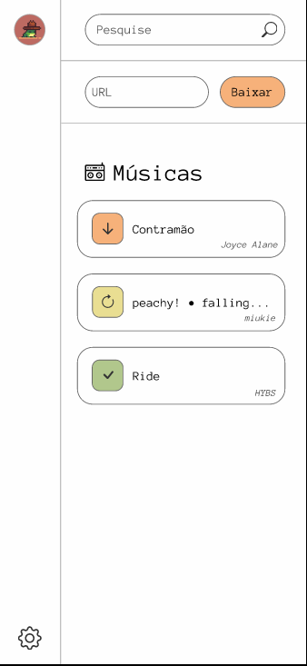

## 📼 BaseMusic 🐦
<table>
    <tr>
    <td>
    Projeto feito em python utilizando o Flask framework.
Sua função é fazer download de músicas, com um design intutivo e agradável.
    </td>
    <td>
    
    </td>
    </tr>
</table>

### Cores -
##### light mode:
- background: #fefefe;
- foreground: black;
- border: #444;
- action: #F6B17A;
- spin: #E9DE92;
- finish: #B1C78C;
##### dark mode:
- background: #2c2c2c;
- foreground: white;
- border: #444;
- action: #F6B17A;
- spin: #E9DE92;
- finish: #B1C78C;

### Links Anexados -
* [Colorhunt](https://colorhunt.co/palette/2d32504247697077a1f6b17a)
* [Figma project](https://www.figma.com/proto/M4Tzojg8FBsVYka6rs61Co/BaseMusic?node-id=1-3&p=f&t=RxhFoLwRzQHdEFZZ-0&scaling=scale-down&content-scaling=responsive&page-id=0%3A1&disable-default-keyboard-nav=1&device-frame=0)